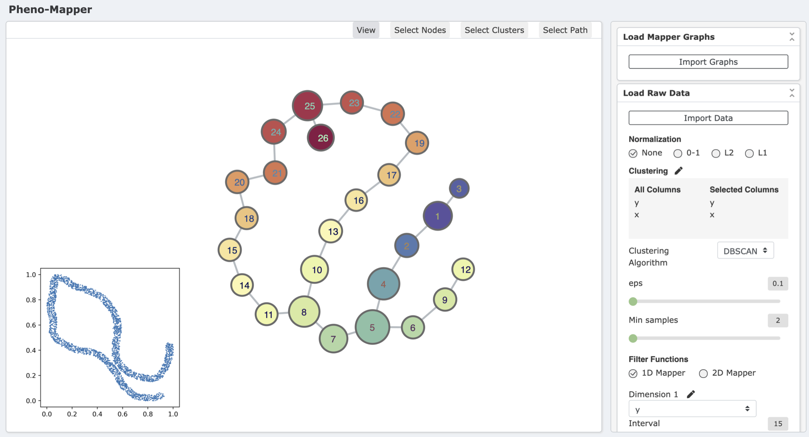
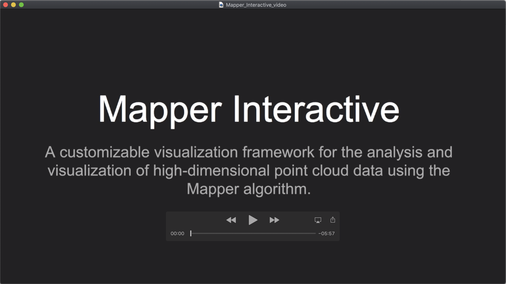

# PhenoMapper

PhenoMapper is an extension of [Mapper Interactive](https://github.com/MapperInteractive/MapperInteractive), which is a web-based framework for interactive analysis and visualization of high-dimensional point cloud data built upon the mapper algorithm.

## Cautionary Message

## Installation

```bash
git clone git@github.com:tdavislab/PhenoMapper.git
cd PhenoMapper
python3 run.py
```

After running the above commands, you can run Mapper Interactive by visiting http://127.0.0.1:8000/ on the local machine (If possible, please use Chrome).

## Dependencies
This software requires [Kepler Mapper](https://kepler-mapper.scikit-tda.org/), [scikit-learn](https://scikit-learn.org/stable/), [NetworkX](https://networkx.github.io/) and [flask](https://flask.palletsprojects.com/en/1.1.x/) to run.

If you do not have these packages installed, please use the following command to intall them.

```bash
pip install scikit-learn
pip install networkx
pip install flask
pip install flask_assets
```

To perform linear regression, please also make sure you have [statsmodels](https://www.statsmodels.org/stable/index.html) installed.
```bash
pip install statsmodels
```

## Interface


<!-- ## Loading a dataset
When loading a dataset into the interface, please make sure to put the data file to be loaded in the folder ``app/static/uploads/``. -->

## Command-line API
Please refer to a user-guide [here](CLI_README.md) for the command-line API.

<!-- ## Video

[](https://www.youtube.com/watch?v=z2VEkv1apF8) -->

<!-- ## License

This project is licensed under the MIT License - see the `LICENSE` file for details. -->

## Data Format

### Importing raw data

To compute a mapper graph, point cloud data can be input in CSV format.

The following is an example of an input CSV file.

```bash
x,y,z
0.013,0.275,0.465
0.216,0.981,-0.424
0.804,-0.424,0.217
...
```

### Importing a pre-computed mapper graph
Using the command-line API, mapper graphs can be computed offline given a point cloud datset. 

The outputting mapper graph will be saved in JSON format, which can be loaded in the GUI.

The following is an example of a mapper graph file.

```bash
{
    "nodes":{
        "cube0_cluster0": [19, 21, 66],
        ...
    },
    "edges":{
        "cube0_cluster0": ["cube1_cluster0"],
        ...
    }
}
```

## Exploratory analysis

In the tool, we provide machine learning modules for futher exploring the input data. Currently, the tool allows to perform linear regression, logistic regression, PCA, t-SNE, and feature selection (based on linear SVC) on both the entire population or a selected subgroup of nodes. Moreover, the tool is designed for users to easily extend the framework to include machine learning modules available from Python libraries *scikit-learn* and *statsmodels*.

### Warning message
<span style="color:blue">Users should take it upon themselves to properly carry out the most appropriate statistical analysis of their datasets.</span>.

### Model assumptions
We list the model assumptions for each machine learning module. Before performing any kind of the exploratory analysis, please make sure the data meets the corresponding assumptions, otherwise, the fitted model might be less effective.

* **Linear regression**: We don't make any additional assumptions for linear regression. The input data should satisfy the following four basic assumptions.
    - Linearity: The relationship between the dependent variable *y* and independent variables *X* are likely to be linear.
    - Homoscedasticity: The variance of residual is the same for any value of *X*.
    - Independence: Observations should be independent of each other.
    - Normality: For any fixed value of *X*, *y* is normally distributed.

* **Logistic regression**:
    - The dependent variable *y* should be binary.
    - Independence: Observations should be independent of each other.

* **PCA**:
    - There is no unique variance, which means the total variance is equal to common variance.

* **t-SNE**:
    - According to the documentation from *scikit-learn*, it is highly recommended to use another dimensionality reduction method (e.g. PCA for dense data or TruncatedSVD for sparse data) to reduce the number of dimensions to a reasonable amount (e.g. 50) if the number of features is very high. (https://scikit-learn.org/stable/modules/generated/sklearn.manifold.TSNE.html)

* **Linear SVC**
    - The dependent variable *y* should be categorical.


## Extendability

### Novice user mode
Under Novice user mode, the new modules can be added by describing the module information within the `app/static/uploads/new_modules.json`. Currently, the tool allows the addition of supervised and unsupervised learning algorithms that are available via `scikit-learn`.

Here is an example of adding a t-SNE module.

```bash
{
    "modules":
    [
        {
            "name":"TSNE",
            "function-name":"sklearn.manifold.TSNE",
            "function-parameters":{
                "n_components":2
            },
            "module-type":"unsupervised_learning",
            "components":["scatter plot"]
        }
    ]
}
```

### Expert user mode
For expert users with programming experience, we provide a template function `call_module_function` in `app/views.py`. A new module can be added by directly modifying the function. It supports customizable and multistep analysis pipelines. 

We also provide a template class `app/static/js/new_module.js` in JavaScript for creating new visual components using `D3.js`.

The styles of visual components are changed via the CSS file `app/static/css/styles.css`.

## Contributing

Pull requests are welcomed. 

## Cite

Pheno-Mapper: An Interactive Toolbox for the Visual Exploration of Phenomics Data.
Youjia Zhou, Methun Kamruzzaman, Patrick Schnable, Bala Krishnamoorthy, Ananth Kalyanaraman, Bei Wang.\
*ACM Conference on Bioinformatics, Computational Biology, and Health Informatics (ACM BCB)*, accepted, 2021.
